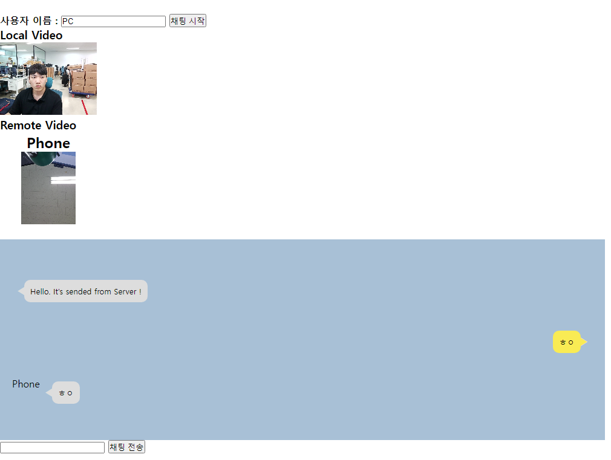
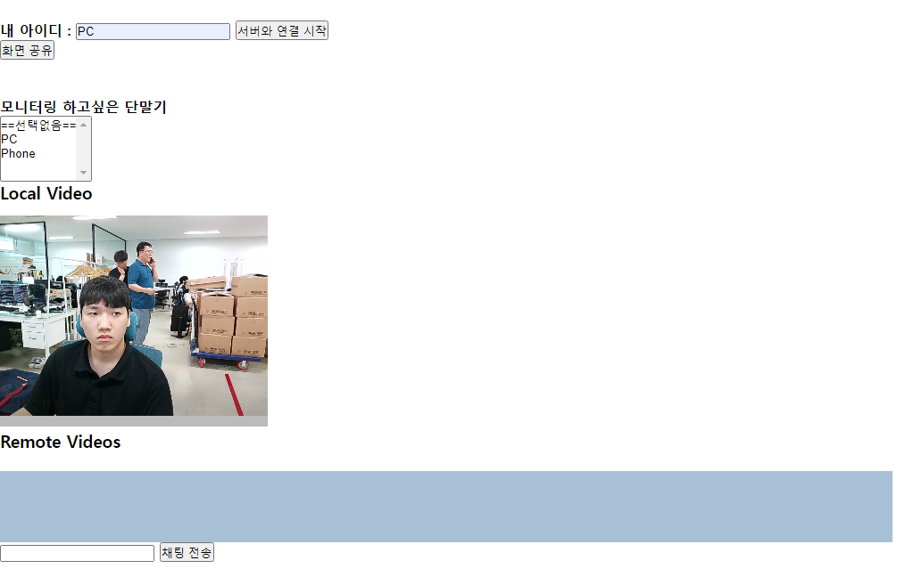

# SFU Test2
- 시그널링 서버와 Peer의 트랙을 관리합니다.   
---

## FaceAndChatting
- 화상채팅 + 실시간 채팅 기능을 탑재
- peer가 전달하는 데이터는 서버를 통해 broadcast됨
- 실행 방법
```
1. main.go 실행
2. https://본인IP:5000 
3. 사용자 이름 입력 후 '채팅 시작'을 누르면 서버와 webrtc 통신을 시작함.
4. enjoy
```   
   
---   

## selectPeer
- 화상채팅 + 실시간 채팅 + 화면 공유 + Peer 선택 기능을 탑재
- (화면 공유는 스마트폰에선 불가능. 스마트폰을 같이 연동하고싶다면 index.html에서 localDisplay를 주석처리하고, index.js에서 displayStream 관련 코드를 주석처리 필요)
- 선택한 Peer의 미디어만 전달받을 수 있음
- 채팅은 broadcast됨
- 실행 방법
```
1. main.go 실행
2. https://본인IP:5000 
3. 아이디 입력 후 '서버와 연결 시작'을 누르면 서버와 webrtc 통신을 시작함.
4. enjoy
```   

